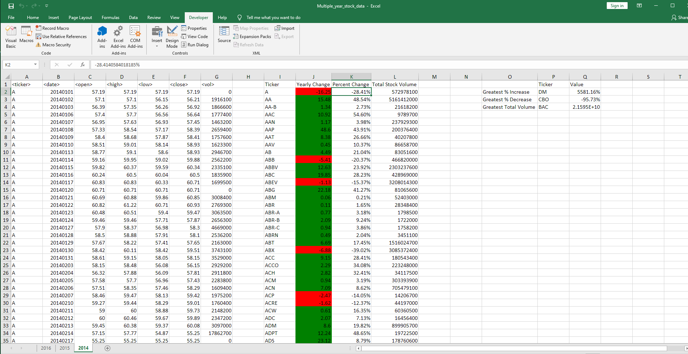
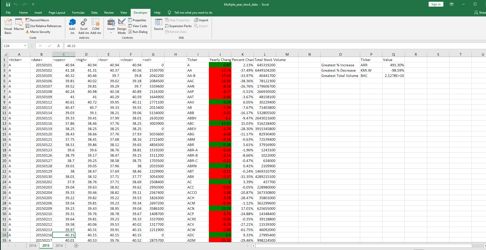
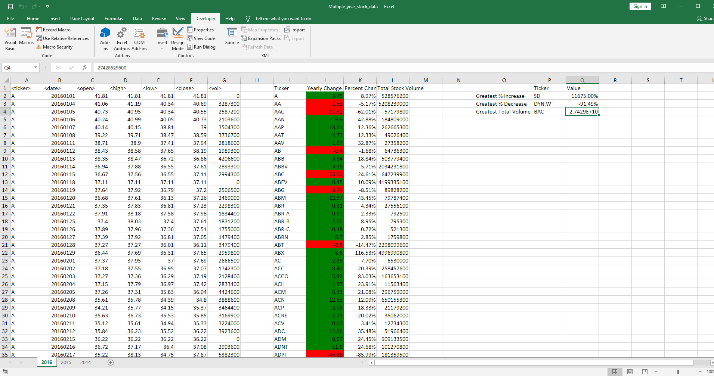

# The VBA of Wall Street

# Project Description

## Purpose of Project
Utilize VBA scripting to analyze real stock market data. 

## Process
 Created a script that loops through all the stocks for one year and outputs the following information: 

- Ticker Symbol

- Yearly change from opening price at the beginning of a given year to the closing price at    the   end of that year

- The percent change from opening price at the beginning of a given year to the closing price at the end of that year

- The total stock volume of the stock  

- Conditional formatting highlights positive change in green and negative change in red 

# Screenshots of Results

